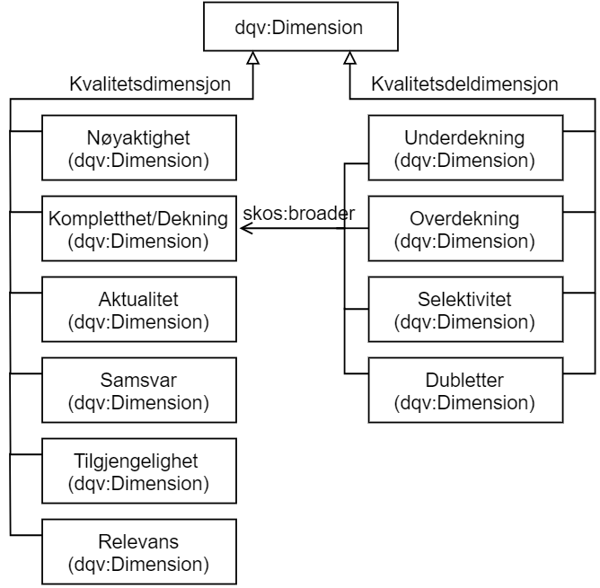

[[Begreper,Begreper og definisjoner]]
= Begreper og definisjoner

Med “kvalitet” (f.eks. i ordene “kvalitetsdimensjon” og “kvalitetsmål”) menes det i dette dokumentet “datakvalitet”, “kvalitet på datasett” og lignende, men ikke “kvalitet” generelt.

Med “mål” (f.eks. i ordet “kvalitetsmål”) menes det i dette dokumentet “måling”/”beregning” (_metric_), men ikke “målsetning”.

[[kvalitetsdimensjon]]
.Kvalitetsdimensjon:

* Anbefalt term: kvalitetsdimensjon
* Alternativ term: dimensjon
* Definisjon: kriterier relevant for evaluering av kvalitet på datasett
** Engelsk original: represents criteria relevant for assessing quality.
*** Kilde til definisjon: https://www.w3.org/TR/vocab-dqv/#dqv:Dimension[dqv:Dimension i W3C DQV]
* Merknad: Tilsvarer https://www.w3.org/TR/vocab-dqv/#dqv:Dimension[dqv:Dimension]
* Eksempler: <<Nøyaktighet>>, <<Kompletthet/Dekning>>

.Kvalitetsdeldimensjon:

* Anbefalt term: kvalitetsdeldimensjon
* Alternativ term: deldimensjon
* Definisjon: en mer detaljert inndeling av en <<kvalitetsdimensjon>>
* Merknad: Datakvalitetsvokabularet DQV fra W3C har ikke definert kvalitets*del*dimensjon som et eget begrep (klasse), men kun kvalitetsdimensjon.
** For å uttrykke kvalitetsdeldimensjon, anbefaler vi å bruke “skos:broader”
** En kvalitetsdeldimensjon inneholder dermed alltid en “skos:broader”-relasjon til den kvalitetsdimensjonen som denne deldimensjonen tilhører.
** Arbeidsgruppen har hittil identifisert behov for kun et nivå av kvalitetsdeldimensjon.
* Merknad: Tilsvarer https://www.w3.org/TR/vocab-dqv/#dqv:Dimension[dqv:Dimension]
* Eksempler: <<Underdekning>> og <<Overdekning>> som kvalitetsdeldimensjoner under kvalitetsdimensjonen <<Kompletthet/Dekning>>.

[[kvalitetsmal,kvalitetsmål]]
.Kvalitetsmål:

* Anbefalt term: kvalitetsmål
* Alternativ term: beregningsmetode for et kvalitetsmål, definisjon av et kvalitetsmål
* Definisjon: definisjon/beskrivelse av måten å beregne/oppgi kvalitetsmål
** Engelsk original: Represents a standard to measure a quality dimension.
*** Kilde til definisjon: https://www.w3.org/TR/vocab-dqv/#dqv:Metric[dqv:Metric]
* Merknad: Tilsvarer https://www.w3.org/TR/vocab-dqv/#dqv:Metric[dqv:Metric]
* Merknad: I henhold til DQV skal selve måleverdi oppgis ved å bruke https://www.w3.org/TR/vocab-dqv/#dqv:QualityMeasurement[dqv:QualityMeasurement]
** Engelsk original: An observation (instance of dqv:QualityMeasurement) assigns a value in a given unit to a Metric.
* Eksempler: <<Andel manglende elementer>> og <<Antall manglende elementer>> som kvalitetsmål langs kvalitetsdeldimensjonen <<Underdekning>>.

.Måleresultat:

* Anbefalt term: måleresultat
* Alternativ term: kvalitetsmåleresultat
* Definisjon: konkret resultat av <<kvalitetsmal>>
** Engelsk original: Represents the evaluation of a given dataset (or dataset distribution) against a specific quality metric.
*** Kilde til definisjon: https://www.w3.org/TR/vocab-dqv/#dqv:QualityMeasurement[dqv:QualityMeasurement]
* Merknad: Tilsvarer https://www.w3.org/TR/vocab-dqv/#dqv:QualityMeasurement[dqv:QualityMeasurement]
* Eksempler: Verdi “0,10” som resultat av “Andel manglende elementer”; verdi “10” som resultat av “Antall manglende elementer”.

.Pre-definerte kvalitetsmål:

* Anbefalt term: pre-definert kvalitetsmål
* Definisjon: <<kvalitetsmal>> (dqv:Metric) som finnes tilgjengelig for gjenbruk, og som kan refereres ved en unik identifikator (URI)
* Merknad: Arbeidsgruppen foreslår å etablere en felles oversikt over pre-definerte kvalitetsmål.
* Eksempler: Annex D i ISO 19157:2013 (E) “List of standardized data quality measures” inneholder en rekke pre-definerte kvalitetsmål.

Nedenfor er en forenklet UML-modell som viser de viktigste begrepene/klassene og relasjoner mellom disse. Tegningen illustrerer også forslag til implementering i DCAT-AP-NO, som er informativt (se <<vedlegg B>> for mer detaljert beskrivelse av forslaget). Det er valgt å bruke norske navn på klassene og rollene, med navn på de vokabularer som skal brukes i implementasjonen i parentes. For å få en full oversikt over modellen må en også se på spesialiseringer og subtyper av andre vokabularer som benyttes i dqv.

image::images/bilde1_kvalitetsbeskrivelser_dqv.jpg[]

_Figur 1__: Kvalitetsbeskrivelser ved å bruke DQV. _

Figuren under illustrerer kvalitetsdimensjoner og kvalitetsdeldimensjoner og relasjon mellom disse, som begge er spesialiseringer av dqv:Dimension. Forskjellen er at en kvalitetsdeldimensjon peker til en kvalitetsdimensjon ved hjelp av https://www.w3.org/2009/08/skos-reference/skos.html#broader[skos:broader]. Det gjøres oppmerksom på at de enkelte kvalitetsdimensjoner og kvalitetsdeldimensjoner som er vist i figuren er kun eksempler og ikke normative.

Figur 2: Eksempler på kvalitetsdimensjoner og kvalitetsdeldimensjoner.
NB! De enkelte kvalitetsdimensjoner og kvalitetsdeldimensjoner er i dette dokumentet informative eksempler, mens måten å relatere en kvalitetsdeldimensjon til den tilhørende kvalitetsdimensjon er normativ (ved å bruke skos:broader).
