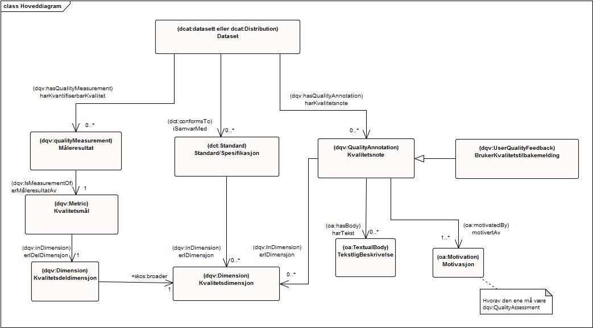
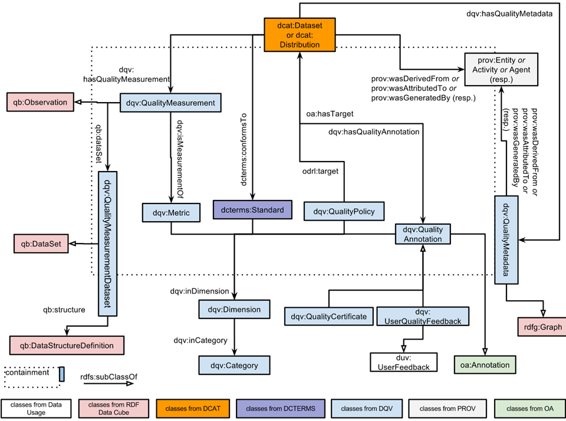

[[vedleggB,vedlegg B]]

= Vedlegg B - Forslag til Implementering i DCAT-AP-NO
Informativ del av dette dokumentet.

Dette vedlegget inneholder først forslag til hvordan beskrivelse av kvalitet på datasett skal kunne implementeres i DCAT-AP-NO. Vedlegget inneholder deretter eksempler på hvordan selve beskrivelsene kan uttrykkes ved å bruke DQV. Kapittel <<Kompletthet/Dekning>> med <<Underdekning>> og kvalitetsmålene der under, viser et relativt komplett eksempel på hva som trengs for å beskrive “Dekning” ved å bruke DQV.

Navnerom (_namespaces_) som er brukt i eksemplene er ikke kvalitetssikret. Navnerom “xxx” er brukt der vi foreløpig ikke fant relevante etablerte vokabular (og dermed bør det opprettes norske vokabularer før de eventuelt kommer inn i relevante internasjonale vokabularer).

=== Implementering i DCAT-AP-NO

I løsningsforslaget til implementering i DCAT-AP-NO baserer vi oss på  prinsippene for RDFS-modellering. En står derfor fritt til å legge til egenskaper som ikke er omtalt i spesifikasjonen. Størst mulig grad av gjenbruk av eksisterende vokabularer er en selvsagt forutsetning.

_Gjengivelse av figur 1 Kvalitetsbeskrivelser ved å -bruke DQV._

Jf. figuren ovenfor som er gjengitt fra kapittel <<Begreper og definisjoner>>, foreslår vi følgende:

 * Beskrivelse av kvantiserbar kvalitet implementeres i DCAT-AP-NO på følgende måte:
 ** Det føyes til et nytt felt i DCAT-AP-NO, med:
 *** URI: https://www.w3.org/TR/vocab-dqv/#dqv:hasQualityMeasurement[dqv:hasQualityMeasurement]
 *** Range: https://www.w3.org/TR/vocab-dqv/#dqv:QualityMeasurement[dqv:QualityMeasurement]
 ** Fritekst-kommentar til et kvantitativt måleresultat beskrives ved å bruke https://www.w3.org/2009/08/skos-reference/skos.html#note[skos:note]
 * Beskrivelse av kvalitet som er i samsvar med gitt(e) standard(er)/spesifikasjon(er) implementeres i DCAT-AP-NO på følgende måte:
 ** Bruk eksisterende felt i DCAT-AP-NO v.1.1, https://doc.difi.no/dcat-ap-no/#datasett-i-samsvar-med[Datasett: i samsvar med]
 ** Der relevant, oppgis hvilke(n) kvalitetsdimensjon(er) standarden/spesifikasjonen dekker, ved å bruke https://www.w3.org/TR/vocab-dqv/#dqv:inDimension[dqv:inDimension].
 * Kvalitetsnote (for ikke-kvantiserbar kvalitet) implementeres i DCAT-AP-NO på følgende måte:
 ** Det føyes til et nytt felt i DCAT-AP-NO, med:
 *** URI: https://www.w3.org/TR/vocab-dqv/#dqv:hasQualityAnnotation[dqv:hasQualityAnnotation]
 *** Range: https://www.w3.org/TR/vocab-dqv/#dqv:QualityAnnotation[dqv:QualityAnnotation]
 ** Selve tekstlig beskrivelse inkluderes (ved å bruke https://www.w3.org/TR/annotation-vocab/#hasbody[oa:hasBody]) i https://www.w3.org/TR/vocab-dqv/#dqv:QualityAnnotation[dqv:QualityAnnotation], som en “body” (som en https://www.w3.org/TR/annotation-vocab/#textualbody[oa:TextualBody])
 ** I henhold til DQV skal det i/fra https://www.w3.org/TR/vocab-dqv/#dqv:QualityAnnotation[dqv:QualityAnnotation] oppgis motivasjon (ved å bruke https://www.w3.org/TR/annotation-vocab/#motivatedby[oa:motivatedBy]) hvorav https://www.w3.org/TR/vocab-dqv/#dqv:qualityAssessment[dqv:QualityAssessment] er minimum å oppgi som motivasjon.
 ** Der relevant, oppgis hvilke(n) kvalitetsdimensjon(er) kvalitetsnoten dekker, ved å bruke https://www.w3.org/TR/vocab-dqv/#dqv:inDimension[dqv:inDimension].
 * Brukertilbakemeldinger relatert til kvalitet på datasett implementeres i DCAT-AP-NO på følgende måte:

 ** Kvalitetsrelaterte brukertilbakemeldinger angis ved å bruke samme feltet som foreslått under forrige kulepunkt for Kvalitetsnote, men med https://www.w3.org/TR/vocab-dqv/#dqv:UserQualityFeedback[dqv:UserQualityFeedback] som range, dvs.:
 *** URI: https://www.w3.org/TR/vocab-dqv/#dqv:hasQualityAnnotation[dqv:hasQualityAnnotation]
 *** Range: https://www.w3.org/TR/vocab-dqv/#dqv:UserQualityFeedback[dqv:UserQualityFeedback]
 ** dqv:UserQualityFeedback er i henhold til DQV en subklasse av dqv:QualityAnnotation, og arver dermed egenskapene fra dqv:QualityAnnotation for å håndtere selve tekstlig beskrivelse og ev. angivelse av kvalitetsdimensjon(er) - jf. kulepunktet ovenfor om Kvalitetsnote.
 ** For brukertilbakemeldinger skal det oppgis motivasjon utover dqv:qualityAssessment i tråd med https://www.w3.org/TR/2016/CR-annotation-model-20160705/#motivation-and-purpose[vokabular for motivasjon og formål] definert i  W3Cs Web Annotations Data model. Merk at en her definerer om brukertilbakemeldingen for eksempel er et spørsmål eller et svar (fra andre brukere eller fra utgiver selv).
 ** Vi anbefaler (ev. vurderer å gjøre obligatorisk senere) å oppgi skaper/avsender og dato for brukertilbakemeldinger ved å benytte dct:creator og dct:created

Eksempel på brukertilbakemelding:
....
 :myDataset
    a dcat:dataset ;
    dqv:hasQualityAnnotation :userFeedback .

 :userFeedback
    a dqv:UserQualityFeedback ;
    dct:creator "Donald Duck" ;
    dct:created "2017-09-13"^^xsd:date ;
    oa:hasBody :usabilityComment ;
    oa:motivatedBy dqv:qualityAssessment, oa:commenting .

 :usabilityComment
    a oa:TextualBody ;
    rdf:value “Dette datasettet er uegnet for ...” ;
    dct:language “nb” ;
    dct:format “text/plain” .
....

_Figur 3: Datamodell som viser de mest relevante klassene i DQV (kilde: _https://www.w3.org/TR/vocab-dqv/DataQuality0.2.9.svg[_W3C DQV]__)._

Jf. figuren ovenfor som er kopiert fra W3C DQV, har arbeidsgruppen i første omgang ikke valgt å standardisere/spesifisere implementering av QualityPolicy og Prov (provenance) som også er i DQV-modellen ovenfor. Dette fordi det i denne omgangen ikke er identifisert konkrete behov/brukerhistorier knyttet til disse. Dette utelukker ikke mulighet for den enkelte virksomheten/sektoren å beskrive kvalitet i form av QualityPolicy og Prov (provenance) slik DQV har definert det. Informer gjerne Difi om erfaringer på dette.

Arbeidsgruppen antar at det vil være behov for å beskrive kvalitet både knyttet til datasett (dcat:dataset) og for distribusjoner (dcat:distribution). Arbeidsgruppen anbefaler at kvalitetsbeskrivelser knyttes til datasett (dcat:dataset) i størst mulig grad. Unntaket er når beskrivelsene eksplisitt gjelder leveransekvalitet, for eksempel beskrivelse av tilgjengelighet, aktualitet eller "conformance" for det ulike leveransene (distribusjonene) av datasettet.

[[Noyaktighet,Nøyaktighet]]

=== Kvalitetsdimensjon Nøyaktighet (accuracy)

*Merknad*: Arbeidsgruppen fant ut at dette var en av de kvalitetsdimensjonene som det allerede er etablert flere parallelle (internasjonale) kvalitetsdeldimensjoner og kvalitetsmål, som også til dels er nokså fagspesifikke. Arbeidsgruppen valgte derfor ikke å bruke tid på å gå dypere langs denne dimensjonen med å eksemplifisere mer i form av kvalitetsdeldimensjoner og kvalitetsmål.

*Definsjon*:

 * I hvilken grad datasettet korrekt representerer virkeligheten, for en spesifikk brukskontekst.
 ** Engelsk original: The degree to which data has attributes that correctly represent the true value of the intended attribute of a concept or event in a specific context of use.
 *** Kilde: https://www.w3.org/TR/vocab-dqv/#DimensionsOfISOIEC25012[W3C DQV].

*Uttrykt i DQV*:  +
@prefix dqv: <https://www.w3.org/TR/vocab-dqv/> . +
@prefix skos: <http://www.w3.org/2004/02/skos/core#> .
....
 :accuracy
    a dqv:Dimension ;
    skos:prefLabel “accuracy”@en ;
    skos:prefLabel “nøyaktighet”@nb ;
    skos:definition “the degree to which data has attributes that correctly represent the true value of the intended attribute of a concept or event in a specific context of use”@en .
....

[[Komplett,Kompletthet/Dekning]]
=== Kvalitetsdimensjon Kompletthet/Dekning (completeness/coverage)

*Merknad*: Arbeidsgruppen fant ut at dette er en av de kvalitetsdimensjonene som det er mulig å bli enig om noen få felles kvalitetsdeldimensjoner og der under kvalitetsmål.

*Merknad*: “Dekning” er bredere enn “Kompletthet” (completeness fra http://iso25000.com/index.php/en/iso-25000-standards/iso-25012[ISO/IEC 25012]). “Dekning” inkluderer bl.a. “Overdekning”. Termen “kompletthet” er allikevel tatt med fordi den allerede er tungt brukt i fagmiljøene.

*Definisjon*:

 * I hvilken grad datasettet inneholder forventede opplysninger, for en spesifikk brukskontekst.

*Uttrykt i DQV*:  +
@prefix dqv: <https://www.w3.org/TR/vocab-dqv/> . +
@prefix skos: <http://www.w3.org/2004/02/skos/core#> .

....
 :coverage
    a dqv:Dimension ;
    skos:prefLabel “coverage”@en ;
    skos:prefLabel “dekning”@nb ;
    skos:altLabel “kompletthet”@nb ;
    skos:definition “i hvilken grad datasettet inneholder forventede opplysninger, for en spesifikk brukskontekst”@nb .
....

[[Underdekning]]
==== Kvalitetsdeldimensjon Underdekning (undercoverage/omission)

*Merknad*: med noe redaksjonelt avvik tilsvarer dette ISO 19157:2013(E) Annex D.2.2.

*Definisjon*:

 * I hvilken grad det mangler elementer som forventes å være med, for en spesifikk brukskontekst.

*Uttrykt i DQV*:  +
@prefix dqv: <https://www.w3.org/TR/vocab-dqv/> . +
@prefix skos: <http://www.w3.org/2004/02/skos/core#> . +
@prefix xxx: <https://ikke.eksisterer.enda/pre_def_kvalitetsmaal/> ;  +
skos:note “antar at det blir etablert en oversikt over pre-definerte kvalitets(del)dimensjoner og kvalitetsmål som kan refereres med en URI”@nb .

....
 :undercoverage
    a dqv:Dimension ;
    skos:prefLabel “undercoverage”@en ;
    skos:prefLabel “underdekning”@nb ;
    skos:altLabel “omission”@en ;
    skos:definition “the degree to which required information is missing in a particular dataset”@en ;
    skos:broader xxx:coverage # antar at “coverage” er definert.
....

===== Kvalitetsmål Manglende elementer (missing items)

*Merknad*: ISO 19757:2013(E) Table D.5 - Missing item definerer et kvalitetsmål på hvorvidt et gitt/spesifikt element mangler, mens det som omhandles her i dette avsnittet er et kvalitetsmål på hvorvidt det mangler noen (uspesifikke) elementer i datasettet, derfor “elementer”/“items” i flertall.

*Definisjon*:

 * Hvorvidt det mangler noen elementer i datasettet.

*Uttrykt i DQV*: +
@prefix dqv: <https://www.w3.org/TR/vocab-dqv/> . +
@prefix skos: <http://www.w3.org/2004/02/skos/core#> . +
@prefix xsd: <https://www.w3.org/TR/xmlschema11-2/> . +
@prefix xxx: <https://ikke.eksisterer.enda/pre_def_kvalitetsmaal/> ;  +
skos:note “antar at det blir etablert en oversikt over pre-definerte kvalitets(del)dimensjoner og kvalitetsmål som kan refereres med en URI”@nb . +

#definisjon av kvalitetsmål +

....
 :missingItemsMetric
    a dqv:Metric ;
    skos:prefLabel “missing items metric”@en ;
    skos:prefLabel “hvorvidt det mangler elementer”@nb ;
    skos:definition “whether there are some items missing in a particular dataset”@en ;
    dqv:expectedDataType xsd:boolean ;
    dqv:inDimension xxx:undercoverage # antar at “undercoverage” er definert .
....
#eksempel på angivelse av måleresultat “true” (ja, det mangler noe)
....
 :measurementMissingItems
    a dqv:QualityMeasurement ;
    dqv:isMeasurementOf :missingItemsMetric ;
    dqv:value “true”^^xsd:boolean .
....

[[Antall,Antall manglende elementer]]
===== Kvalitetsmål Antall manglende elementer (number of missing items)

*Definisjon*:

 * Antall elementer som ikke er i datasettet men som forventes å være med.

*Uttrykt i DQV*: +
@prefix dqv: <https://www.w3.org/TR/vocab-dqv/> . +
@prefix skos: <http://www.w3.org/2004/02/skos/core#> . +
@prefix xsd: <https://www.w3.org/TR/xmlschema11-2/> . +
@prefix xxx: <https://ikke.eksisterer.enda/pre_def_kvalitetsmaal/> ;  +
  skos:note “antar at det blir etablert en oversikt over pre-definerte kvalitets(del)dimensjoner og kvalitetsmål som kan refereres med en URI”@nb . +

#definisjon av kvalitetsmål
....
 :numberOfMissingItemsMetric
    a dqv:Metric ;
    skos:prefLabel “number of missing items metric”@en ;
    skos:prefLabel “antall manglende elementer”@nb ;
    skos:definition “number of items that are missing in the dataset”@en ;
    dqv:expectedDataType xsd:integer ;
    dqv:inDimension xxx:undercoverage # antar at “undercoverage” er definert .
....
#eksempel på angivelse av måleresultat “8” (mangler åtte elementer)
....
 :measurementNumerOfMissingItems
    a dqv:QualityMeasurement ;
    dqv:isMeasurementOf :numberOfMissingItemsMetric ;
    dqv:value “8”^^xsd:integer .
....

[[Andel,Andel manglende elementer]]
===== Kvalitetsmål Andel manglende elementer (rate of missing items)

*Definisjon*:

 * Forholdet mellom antall elementer som mangler og antall elementer som skulle være med i datasettet.

*Uttrykt i DQV*: +
@prefix dqv: <https://www.w3.org/TR/vocab-dqv/> . +
@prefix skos: <http://www.w3.org/2004/02/skos/core#> . +
@prefix xsd: <https://www.w3.org/TR/xmlschema11-2/> . +
@prefix xxx: <https://ikke.eksisterer.enda/pre_def_kvalitetsmaal/> ;  +
skos:note “antar at det blir etablert en oversikt over pre-definerte kvalitets(del)dimensjoner og kvalitetsmål som kan refereres med en URI”@nb .

#definisjon av kvalitetsmål +
....
 :rateOfMissingItemsMetric
    a dqv:Metric ;
    skos:prefLabel “rate of missing items metric”@en ;
    skos:prefLabel “andel manglende elementer”@nb ;
    skos:definition “ratio between the number of items that are missing and the number of the items that should be present”@en ;
    dqv:expectedDataType xsd:decimal ;
    dqv:inDimension xxx:undercoverage # antar at “undercoverage” er definert .
....
#eksempel på angivelse av måleresultat “0.08” (mangler 8%) +
....
 :measurementRateOfMissingItems
    a dqv:QualityMeasurement ;
    dqv:isMeasurementOf :rateOfMissingItemsMetric ;
    dqv:value “0.08”^^xsd:decimal .
....

[[Overdekning]]
==== Kvalitetsdeldimensjon Overdekning (overcoverage/commission)

Overdekning kan defineres på helt tilsvarende måte (men “motsatt vis”) som for underdekning i avsnittet foran, dvs. om elementer som ikke skulle vært i datasettet. Arbeidsgruppen velger derfor ikke å bruke tid på å eksemplifisere denne deldimensjonen.

*Merknad*: med noe redaksjonelt avvik tilsvarer dette ISO 19157:2013(E) Annex D.2.1.

*Definisjon*:

 * I hvilken grad datasettet inneholder overflødige elementer

*Merknad til definisjonen*:

 * Eksklusive <<dubletter>> (som er en egen kvalitetsdeldimensjon)

*Uttrykt i DQV*:  +
@prefix dqv: <https://www.w3.org/TR/vocab-dqv/> . +
@prefix skos: <http://www.w3.org/2004/02/skos/core#> . +
@prefix xxx: <https://ikke.eksisterer.enda/pre_def_kvalitetsmaal/> ;  +
skos:note “antar at det blir etablert en oversikt over pre-definerte kvalitets(del)dimensjoner og kvalitetsmål som kan refereres med en URI”@nb . +
....
 :overcoverage
    a dqv:Dimension ;
    skos:prefLabel “overcoverage”@en ;
    skos:prefLabel “overdekning”@nb ;
    skos:altLabel “commission”@en ;
    skos:definition “the degree to which a particular dataset contains excess items”@en ;
    skos:note “exclusive duplicate”@en ;
    skos:broader xxx:coverage # antar at “coverage” er definert .
....

==== Kvalitetsdeldimensjon Selektivitet (selectivity)

*Definisjon*:

 * I hvilken grad datasettet dekker den statistiske populasjonen.

*Uttrykt i DQV*:  +
@prefix dqv: <https://www.w3.org/TR/vocab-dqv/> . +
@prefix skos: <http://www.w3.org/2004/02/skos/core#> . +
@prefix xxx: <https://ikke.eksisterer.enda/pre_def_kvalitetsmaal/> ;  +
skos:note “antar at det blir etablert en oversikt over pre-definerte kvalitets(del)dimensjoner og kvalitetsmål som kan refereres med en URI”@nb . +
....
 :selectivity
    a dqv:Dimension ;
    skos:prefLabel “selectivity”@en ;
    skos:prefLabel “selektivitet”@nb ;
    skos:definition “the degree to which a particular dataset represents the statistical population”@en ;
    skos:broader xxx:coverage # antar at “coverage” er definert .
....

[[dublett,dubletter]]
==== Kvalitetsdeldimensjon Dublett (redundancy/duplicate)

*Definisjon*:

 * I hvilken grad datasettet inneholder flere enn én forekomst av samme opplysning.

*Uttrykt i DQV*:  +
@prefix dqv: <https://www.w3.org/TR/vocab-dqv/> . +
@prefix skos: <http://www.w3.org/2004/02/skos/core#> . +
@prefix xxx: <https://ikke.eksisterer.enda/pre_def_kvalitetsmaal/> ;  +
skos:note “antar at det blir etablert en oversikt over pre-definerte kvalitets(del)dimensjoner og kvalitetsmål som kan refereres med en URI”@nb . +
....
 :redundancy
    a dqv:Dimension ;
    skos:prefLabel “redundancy”@en ;
    skos:altLabel “duplicate”@en ;
    skos:prefLabel “dublett”@nb ;
    skos:definition “the degree to which a particular dataset contains more than one instance of the same information”@en ;
    skos:broader xxx:coverage # antar at “coverage” er definert .
....

=== Kvalitetsdimensjon Aktualitet (currentness/timeliness)

*Definisjon*:

 * Graden av “ferskhet” av datasettet, for en spesifikk brukskontekst.
 ** Engelsk original: The degree to which data has attributes that are of the right age in a specific context of use.
 *** Kilde: https://www.w3.org/TR/vocab-dqv/#DimensionsOfISOIEC25012[W3C DQV].

*Uttrykt i DQV*:  +
@prefix dqv: <https://www.w3.org/TR/vocab-dqv/> . +
@prefix skos: <http://www.w3.org/2004/02/skos/core#> . +
....
 :currentness
    a dqv:Dimension ;
    skos:prefLabel “currentness”@en ;
    skos:altLabel “timeliness”@en ;
    skos:prefLabel “aktualitet”@nb ;
    skos:definition “the degree to which data has attributes that are of the right age in a specific context of use”@en .
....
=== Kvalitetsdimensjon Samsvar (compliance/conformity)

*Definisjon*:

 * I hvilken grad datasettet er i samsvar med standarder, konvensjoner, regler eller lignende som regulerer datakvalitet, for en spesifikk brukskontekst.
 ** Engelsk original: The degree to which data has attributes that adhere to standards, conventions or regulations in force and similar rules relating to data quality in a specific context of use.
 *** Kilde: https://www.w3.org/TR/vocab-dqv/#DimensionsOfISOIEC25012[W3C DQV].

*Uttrykt i DQV*:  +
@prefix dqv: <https://www.w3.org/TR/vocab-dqv/> . +
@prefix skos: <http://www.w3.org/2004/02/skos/core#> . +
....
 :compliance
    a dqv:Dimension ;
    skos:prefLabel “compliance”@en ;
    skos:altLabel “conformity”@en ;
    skos:prefLabel “samsvar”@nb ;
    skos:definition “the degree to which data has attributes that adhere to standards, conventions or regulations in force and similar rules relating to data quality in a specific context of use”@en .
....

==== Kvalitetsbeskrivelse I samsvar med (conforms to)

*Definisjon*:

 * Datasettet er i samsvar med gitt standard, spesifikasjon, regel og lignende

*Uttrykt i DQV*:  +
@prefix dcat: <https://www.w3.org/ns/dcat#> . +
@prefix dqv: <https://www.w3.org/TR/vocab-dqv/> . +
@prefix skos: <http://www.w3.org/2004/02/skos/core#> . +
@prefix dcterms: <http://dublincore.org/documents/dcmi-terms/> . +
@prefix foaf: <http://xmlns.com/foaf/spec/> . +
@prefix xsd: <https://www.w3.org/TR/xmlschema11-2/> . +
@prefix xxx: <https://ikke.eksisterer.enda/pre_def_kvalitetsmaal/> ;  +
skos:note “antar at det blir etablert en oversikt over pre-definerte kvalitets(del)dimensjoner og kvalitetsmål som kan refereres med en URI”@nb .
....
 :myDataset
    a dcat:dataset ;
    dcterms:conformsTo :aQualityStandard .

 :aQualityStandard
    a dcterms:Standard ;
    dcterms:title "Standard for ..."@en ;
    dcterms:comment “The standard defines ...”@en ;
    dcterms:issued "2017-08-01"^^xsd:date ;
    foaf:page <https://path.ToThe.Standard/aStandard> ;
    dqv:inDimension xxx:compliance # antar at “compliance” er definert .
....

=== Kvalitetsdimensjon Tilgjengelighet (availability)

*Definisjon*:

 * I hvilken grad datasettet kan nåes av brukere og/eller dataapplikasjoner, for en spesifikk brukskontekst.
 ** Engelsk original: The degree to which data has attributes that enable it to be retrieved by authorized users and/or applications in a specific context of use.
 *** Kilde: https://www.w3.org/TR/vocab-dqv/#DimensionsOfISOIEC25012[W3C DQV].

*Uttrykt i DQV*:  +
@prefix dqv: <https://www.w3.org/TR/vocab-dqv/> . +
@prefix skos: <http://www.w3.org/2004/02/skos/core#> . +
....
:availability
    a dqv:Dimension ;
    skos:prefLabel “availability”@en ;
    skos:prefLabel “tilgjengelighet”@nb ;
    skos:definition “the degree to which data has attributes that enable it to be retrieved by users and/or applications in a specific context of use”@en .
....

=== Kvalitetsdimensjon Relevans (relevancy)

*Definisjon*:

 * I hvilken grad datasettet inneholder data som dekker behov, for en spesifikk brukskontekst.
 ** Engelsk original: Relevancy refers to the provision of information which is in accordance with the task at hand and important to the users’ query.
 *** Kilde: https://www.w3.org/TR/vocab-dqv/#DimensionsofZaveri[W3C DQV].

*Uttrykt i DQV*:  +
@prefix dqv: <https://www.w3.org/TR/vocab-dqv/> . +
@prefix skos: <http://www.w3.org/2004/02/skos/core#> . +
....
 :relevancy
    a dqv:Dimension ;
    skos:prefLabel “relevancy”@en ;
    skos:prefLabel “relevans”@nb ;
    skos:definition “the provision of information which is in accordance with the task at hand and important to the users”@en .
....

==== Ikke-kvantitativ/fritekst beskrivelse Bruksformål (specific usage)

*Definisjon*:

 * Fritekst beskrivelse av hva datasettet er opprettet/innsamlet for

*Uttrykt i DQV*: +
@prefix dcat: <https://www.w3.org/ns/dcat#> . +
@prefix dqv: <https://www.w3.org/TR/vocab-dqv/> . +
@prefix skos: <http://www.w3.org/2004/02/skos/core#> . +
@prefix dc: <http://dublincore.org/documents/dces/> . +
@prefix oa: <http://www.w3.org/ns/oa#> . +
@prefix rdf: <http://www.w3.org/1999/02/22-rdf-syntax-ns#> . +
@prefix xsd: <https://www.w3.org/TR/xmlschema11-2/> . +
@prefix xxx: <https://ikke.eksisterer.enda/pre_def_kvalitetsmaal/> ;  +
skos:note “antar at det blir etablert en oversikt over pre-definerte kvalitets(del)dimensjoner og kvalitetsmål som kan refereres med en URI”@nb .

....
 :myDataset
    a dcat:dataset ;
    dqv:hasQualityAnnotation :usageAnnotation .

 :usageAnnotation
    a dqv:QualityAnnotation ;
    skos:prefLabel “usability”@en ;
    skos:prefLabel “egnethet”@nb ;
    skos:definition “hva datasettet er opprettet/innsamlet for”@nb ;
    dqv:inDimension xxx:relevancy # antar at “relevancy” er definert ;
    oa:hasBody :usageDescription ;
    oa:motivatedBy dqv:qualityAssessment .

 :usageDescription
    a oa:TextualBody ;
    rdf:value “datasettet er opprettet for ...” ;
    dc:language “nb” ;
    dc:format “text/plain” .
....

==== Ikke-kvantitativ/fritekst beskrivelse Egnethet (usability)

*Definisjon*:

 * Fritekst beskrivelse av hva datasettet er, og ikke er, egnet til

*Uttrykt i DQV*:  +
@prefix dcat: <https://www.w3.org/ns/dcat#> . +
@prefix dqv: <https://www.w3.org/TR/vocab-dqv/> . +
@prefix skos: <http://www.w3.org/2004/02/skos/core#> . +
@prefix dc: <http://dublincore.org/documents/dces/> . +
@prefix oa: <http://www.w3.org/ns/oa#> . +
@prefix rdf: <http://www.w3.org/1999/02/22-rdf-syntax-ns#> . +
@prefix xsd: <https://www.w3.org/TR/xmlschema11-2/> . +
@prefix xxx: <https://ikke.eksisterer.enda/pre_def_kvalitetsmaal/> ;  +
skos:note “antar at det blir etablert en oversikt over pre-definerte kvalitets(del)dimensjoner og kvalitetsmål som kan refereres med en URI”@nb .

....
 :myDataset
    a dcat:dataset ;
    dqv:hasQualityAnnotation :usageAnnotation .

 :usabilityAnnotation
    a dqv:QualityAnnotation ;
    skos:prefLabel “usability”@en ;
    skos:prefLabel “egnethet”@nb ;
    skos:definition “hva datasettet er, og ikke er, egnet til”@nb ;
    dqv:inDimension xxx:relevancy # antar at “relevancy” er definert ;
    oa:hasBody :usabilityDescription ;
    oa:motivatedBy dqv:qualityAssessment .

 :usabilityDescription
    a oa:TextualBody ;
    rdf:value “datasettet er best egnet for å beregne …, men kan by på utfordringer når det også brukes til å analysere ...” ;
    dc:language “nb” ;
    dc:format “text/plain” .
....
