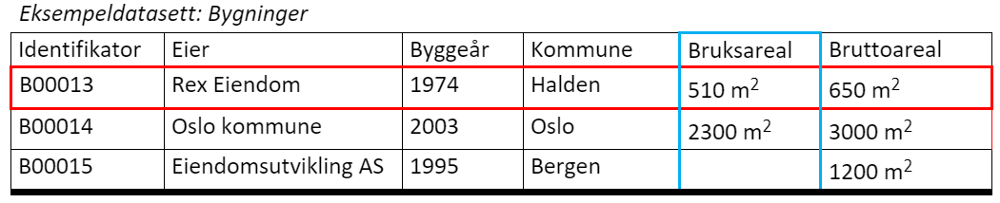

== Hensyn man bør ta når man beskriver kvantifiserbar kvalitet på datasett[[hensyn]]

===	Kvalitet kan måles på ulike nivåer
Datakvalitet kan måles på både enhetsnivå og egenskapsnivå. I eksempeldatasettet under vil hver bygning være en enhet (markert med rød ramme), mens opplysningene som er knyttet til hver bygning er en egenskap (eksemplifisert med blå ramme for egenskapen «bruksareal»; «eier», «byggeår», «kommune» og «bruttoareal» er også egenskaper). Se for øvrig definisjon på enhet og egenskap i <<#definisjoner>>.

Der det er relevant, finnes det predefinere kvalitetsmål for både enhet- og egenskapsnivå. Et eksempel er kvalitetsmålene «antall manglende enheter» og «antall enheter med manglende verdi for en gitt egenskap» under kvalitetsdimensjonen «fullstendighet» som går på henholdsvis enhetsnivå og egenskapsnivå. I eksempeldatasettet under mangler det verdi for egenskapen «bruksareal» for Bygning nr. B00015.

.Eksempeldatasett: Bygninger
//// 
[width="100%",options="header,footer"]
|====================
| Identifikator| Rex Eiendom |Byggeår | Kommune | Bruksareal | Bruttoareal
|B00013 | Rex Eiendom | 1974 | Halden  | 510 m2 | 650 m2
|B00014 | Oslo kommune | 2003 | Oslo | 2300 m2 | 3000 m2
|B00015 | Eiendomsutvikling AS | 1995 | Bergen |  | 1200 m2
|====================
////

=== Predefinerte kvalitetsmål bruker negativt ladede ord

I predefineringen av kvalitetsmål er det valgt å bruke såkalte negativt ladede ord for flere av kvalitetsmålene. Negativt ladede ord tydeliggjør feil og mangler i datakvaliteten.

Et eksempel er kvalitetsmålet «andel manglende enheter» som handler om mangel. Det vil være for eksempel 2 % _mangel_ (negativt ladet) istedenfor 98 % _fullstendig_ (positivt ladet) som oppgis. Det er viktig å være klar over dette, både ved angivelse av verdier til kvalitetsmål og ved visning av verdiene i et sluttbrukergrensesnitt. I et konkret sluttbrukergrensesnitt kan man godt presentere det positivt (f.eks. regne om «2 % mangel» til «98 % fullstendig» og presentere resultatet positivt).

===	Fritekst kan brukes som supplerende forklaring
https://doc.difi.no/data/kvalitet-pa-datasett/[Spesifikasjon for beskrivelse av kvalitet på datasett] tillater bruk av fritekst-kommentarer som supplerende forklaringer til et kvantifiserbart kvalitetsmål. For eksempel, til vårt eksempeldatasett «Bygninger», hvis resultatet på kvalitetsmålet «enheter med manglende verdi for en gitt egenskap» er «2 %», kan man i fritekst-kommentaren spesifisere hvilken egenskap mangelen gjelder, for eksempel: «Dette gjelder egenskap ‘byggeår’».

For de aller fleste brukstilfeller antok arbeidsgruppen som utarbeidet disse definisjonene, at det burde holde med supplerende fritekst-kommentarer. For avanserte kvalitetsbeskrivelser, for eksempel der det er behov for å avgi resultater for hver enkelt egenskap, er det i henhold til DQV mulig å oppgi slike resultater som egne datasett (https://www.w3.org/TR/vocab-dqv/#dqv:QualityMeasurementDataset[dqv:QualityMeasurementDataset]). For eksempel en «tabell» som sier «2 % mangel» for egenskap «byggeår», «3 % mangel» for egenskap «bruksareal» og «0 % mangel» for alle de andre egenskapene:

[width="100%",options="header,footer"]
|====================
| Egenskap |Eier  |Byggeår  |Kommune  |Bruksareal  |Bruttoareal
| Andel enheter med manglende verdi for en gitt egenskap | 0% |2%|0% |3%  |  0%
|====================

===	Hvilke kvalitetsmål som erfaringsmessig er viktige for brukerne å vite

Ikke alle de predefinerte kvalitetsmålene er relevant å måle i enhver sammenheng. Man står fritt til å velge ut de kvalitetsmålene som er aktuelle for datasettet. I noen tilfeller er det «nøyaktighet» som er viktigst for brukerne av datasettet, i andre tilfeller kan det være «konsistens», eller begge. I mange tilfeller må man også ta høyde for at det er flere ulike typer brukere. Man bør derfor velge de kvalitetsmålene som erfaringsmessig er viktige for mange brukere av det aktuelle datasettet.

Samme prinsipp gjelder for kvalitetsmålets verditype. Flere av kvalitetsmålene kan måles på inntil tre forskjellige måter: boolsk (ja/nei), heltall (antall) og prosent (andel). Dette er for å legge til rette for nivået av innsikt i kvaliteten på datasettet. For eksempel kan det være at man vet at datasettet mangler noen enheter, men ikke hvor mange eller hvor stor andel, bl.a. fordi man i utgangspunktet ikke vet hvor mange og hvilke som skal være med. I slike tilfeller benytter man seg av den boolske verditypen («ja, noen enheter mangler»). I de tilfellene der man vet hvor mange enheter som mangler, benytter man seg av heltall («fire enheter mangler») og/eller prosent («5% av enhetene mangler») hvis man også vet hvor mange enheter som skulle vært med i datasettet.

Når man beskriver et datasett som gjøres tilgjengelig for andre, beskriver man som regel kvalitet ut fra sin egen brukskontekst. Om kvaliteten som er beskrevet fra datatilbyderens ståsted er god (nok) eller ikke for brukerne av datasettet, er avhengig av brukskontekst og bruksformål. «2 % mangel» kan være bra for noen og ikke bra nok for andre.

Når man beskriver kvalitet på datasett som er løpende oppdatert (f.eks. direkte oppslag i et register som løpende ajourholdes), vil det være umulig på forhånd å vite nøyaktig hvilken kvalitet datasettet kommer til å ha. Man vil derfor som regel basere seg på erfaringene man har med datasettet, f.eks. «Statistisk sett er det 2% etterregistrering» som fritekstkommentar til «2% mangel».
